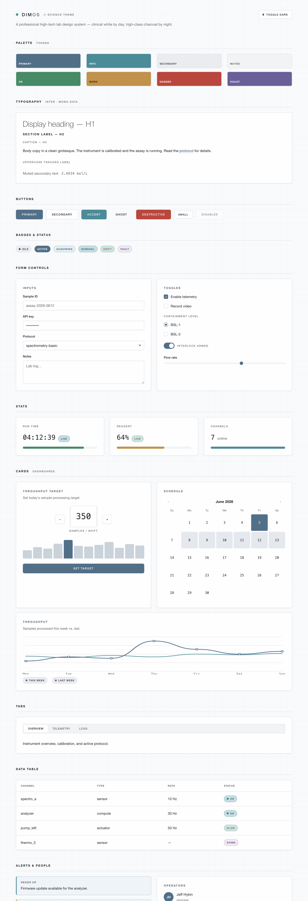
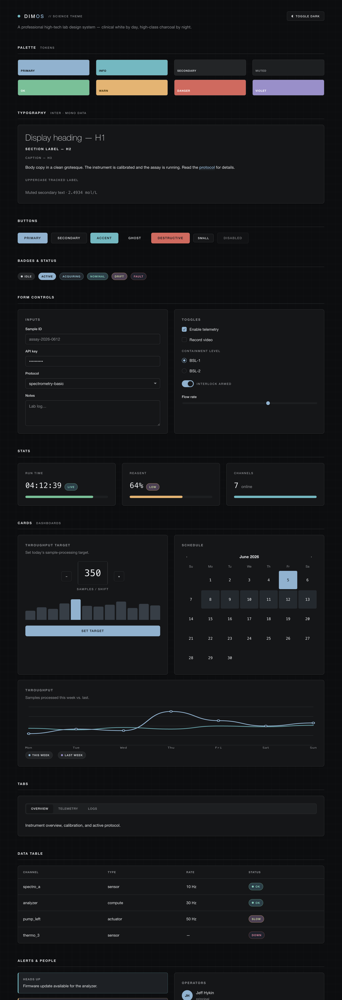
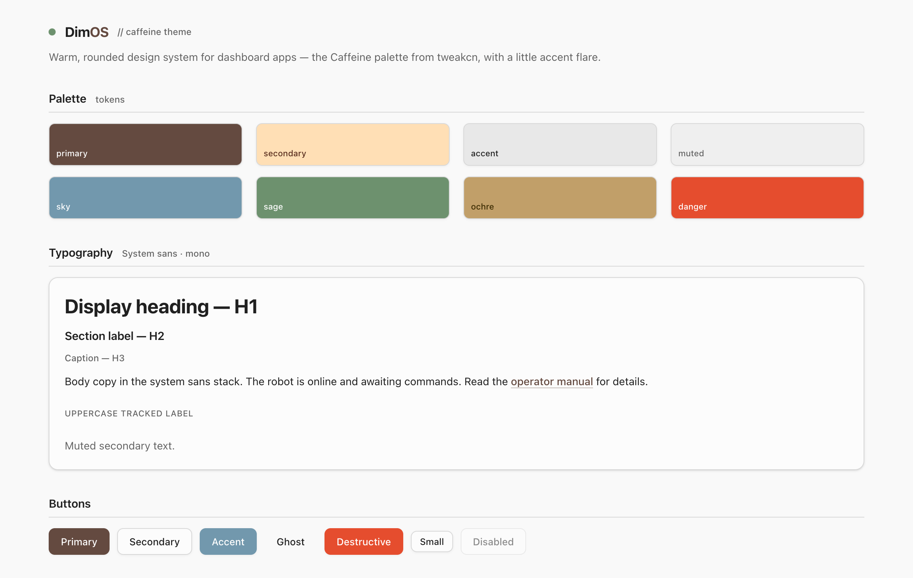
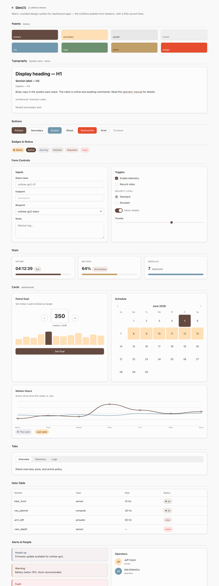
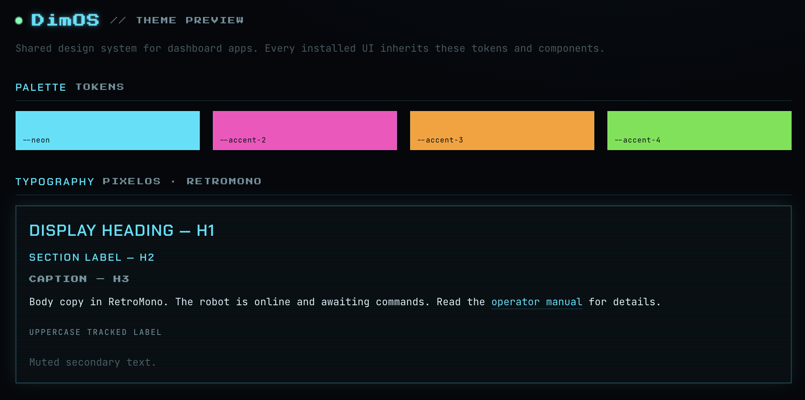
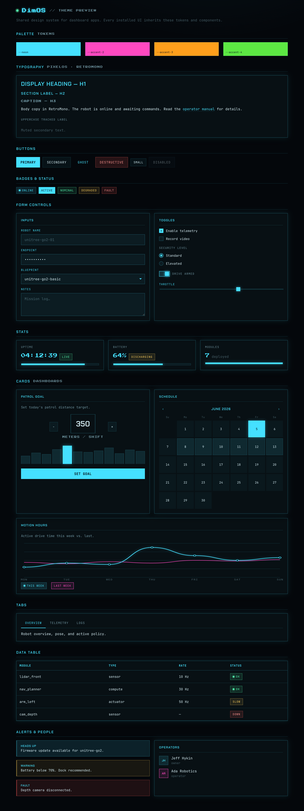

# Dimos Themes

A small collection of drop-in design systems for DimOS dashboard apps. Every theme exposes
the **same component API** (the `dim-*` classes — buttons, badges, form controls, stat cards,
progress bars, stepper, calendar, line/bar charts, tabs, data tables, alerts, avatars), so an
app can swap one stylesheet and keep all of its markup.

Each theme lives in its own folder under [`themes/`](themes/) with a self-contained
`index.html` styleguide you can open directly in a browser.

---

## 🔬 Science  ·  the flagship

A professional, high-tech laboratory system styled like a **luxury-automotive instrument
cluster**. Cool titanium/platinum neutrals — near-white by day, deep graphite by night — with
a restrained steel accent and brushed-steel/cyan for data. The luxury reads through the
*structure*: large light-weight display headings, wide uppercase letter-spaced instrument
labels, thin tabular-mono readouts, generous whitespace, hairline dividers, and crisp corners.

Light is the default; add `dark` to the body (or open the preview with `#dark`).

| Light | Dark |
| --- | --- |
|  |  |

```html
<link rel="stylesheet" href="themes/science/theme.css" />
<body class="science"> ... </body>          <!-- light (default) -->
<body class="science dark"> ... </body>      <!-- high-class dark -->
```

---

## ☕ Caffeine

Warm, rounded, friendly — built on the
[Caffeine theme from tweakcn](https://tweakcn.com/editor/theme) (espresso/latte neutrals, soft
shadows, `0.5rem` corners). The accents follow an established earth-tone palette so they
complement the brown rather than fight it: **sage green**, **dusty sky-blue**, and a **muted
ochre** (no violet).



```html
<link rel="stylesheet" href="themes/caffeine/theme.css" />
<body class="caffeine"> ... </body>
```

<details><summary>Full styleguide</summary>



</details>

---

## 🕹 Retro Zero

Retro-futuristic HUD — neon-cyan hairlines, solid dark panels, faint scanlines, hard corners,
uppercase pixel/mono type, soft glow.



```html
<link rel="stylesheet" href="themes/retro_zero/fonts.css" />
<link rel="stylesheet" href="themes/retro_zero/theme.css" />
<body class="dimos"> ... </body>
```

<details><summary>Full styleguide</summary>



</details>

---

## Reskinning

Every theme's colors are CSS variables at the top of its `theme.css` — override them to
retune a theme without touching components. Retro Zero uses hex tokens (`--neon`,
`--accent-2`, `--bg`, …); Caffeine and Science use `oklch()` design tokens
(`--primary`, `--secondary`, `--info`, `--bg`, …), with Science's dark mode defined as
overrides on `body.science.dark`.
