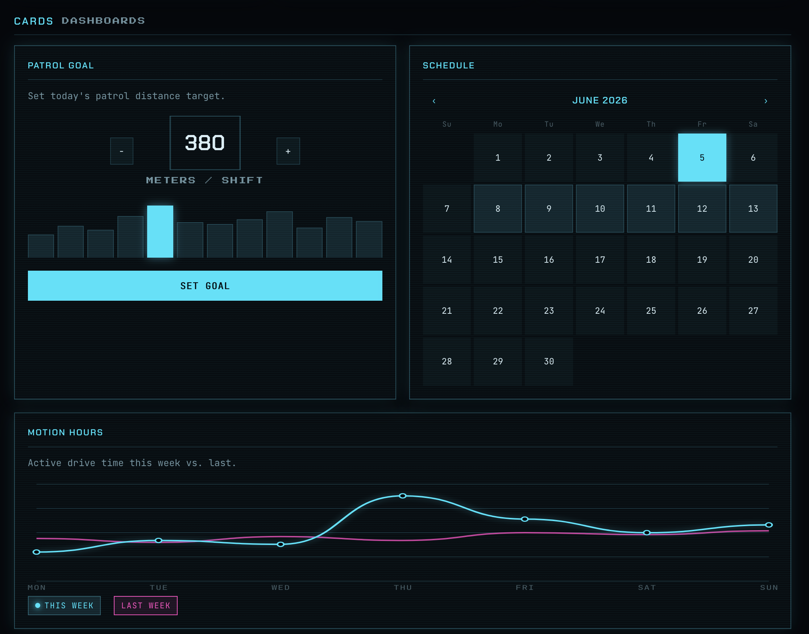

# Dimos Themes

A retro-futuristic design system for DimOS dashboard apps.

**🔗 Live preview / styleguide:** https://jeff-hykin.github.io/dimos_themes/

## Preview




<details>
<summary>Full styleguide (every component)</summary>


</details>

## Usage

The whole look is driven by a single stylesheet. Drop the two files into your app and the
components below are themed automatically:

```html
<link rel="stylesheet" href="fonts.css" />
<link rel="stylesheet" href="theme.css" />
<body class="dimos"> ... </body>
```

All design tokens are CSS variables on `:root` (see [`docs/theme.css`](docs/theme.css)) —
override them to reskin an app:

```css
:root {
  --neon: #45e0ff;   /* primary accent */
  --accent-2: #ff49c0;
  --bg: #04070b;
  /* ...colors, surfaces, lines, type, and effects */
}
```

## What's included

Buttons, badges & status pills, form controls (inputs, selects, checkboxes, radios,
switches, ranges), stat cards, progress bars, a goal stepper, calendar, line/bar charts,
tabs, data tables, alerts, and avatars — see the [live preview](https://jeff-hykin.github.io/dimos_themes/)
for the full set.
